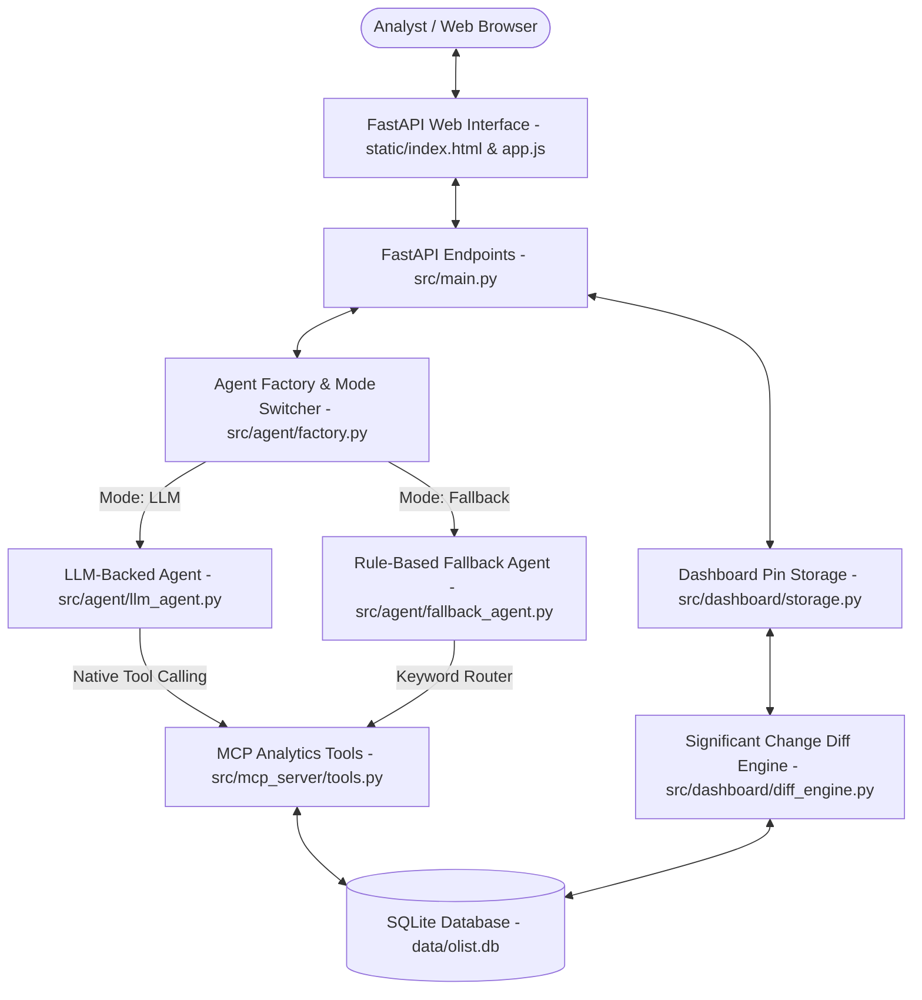

# E-Commerce Sales Analytics Chatbot & Chart Builder

Comprehensive System Architecture & Technical Implementation Documentation.

---

## 1. Executive Summary & Problem Overview

E-Commerce analysts spend hours querying relational databases, writing ad-hoc SQL statements, and manually building charts in spreadsheet applications. 

This system provides a full-stack, AI-driven analytics application that allows analysts to type plain-English questions (e.g. *"Show monthly revenue trend for 2017"* or *"What share of payments are credit card vs boleto?"*) and immediately receive:
1. **Data Analytics Response**: SQL execution results over the ~100,000 order Brazilian Olist dataset.
2. **Deterministic Chart Recommendation**: Chart.js configuration tailored to data shape with a 1-line justification.
3. **1-Sentence Data Insight**: Automated headline summarizing key analytical trends.
4. **Pinnable Dashboard**: Session-persistent dashboard pinboard with metric refresh change detection.

---

## 2. System Architecture



---

## 3. Database Ingestion & Relational Schema (`src/database/loader.py`)

The system operates on the **Brazilian E-Commerce Public Dataset by Olist** (~100MB, 8 relational tables + 1 category translation table).

### Table Schema & Relationships:
1. `olist_orders`: Central fact table containing `order_id`, `customer_id`, `order_status`, `order_purchase_timestamp`, `order_delivered_customer_date`, `order_estimated_delivery_date`.
2. `olist_order_items`: Links orders to `product_id` and `seller_id` with `price` and `freight_value`.
3. `olist_order_payments`: Payment method breakdown (`payment_type`, `payment_installments`, `payment_value`).
4. `olist_order_reviews`: Review ratings (`review_score`, creation/answer timestamps).
5. `olist_products`: Product dimensions, category names in Portuguese.
6. `olist_sellers`: Seller locations (`seller_city`, `seller_state`).
7. `olist_customers`: Customer locations (`customer_city`, `customer_state`).
8. `olist_geolocation`: Geographic coordinates mapped by `zip_code_prefix`.
9. `product_category_name_translation`: Maps Portuguese category names (`product_category_name`) to English (`product_category_name_english`).

### Automated Ingestion & Indexing:
- **`build_sqlite_database()`**: Checks if `data/olist.db` exists. If missing, parses all raw CSV files in `data/` and builds indexed SQLite tables.
- **Indexes**: Built on `order_id`, `product_id`, `seller_id`, `customer_id`, `zip_code_prefix`, and `order_purchase_timestamp` for sub-second query performance.
- **Fallback Generator**: If raw Kaggle CSV files are not present, realistic synthetic Olist data covering 2016–2018 is automatically generated so the system runs out of the box with zero manual setup.

---

## 4. Model Context Protocol (MCP) Tool Layer (`src/mcp_server/`)

Built using the official Python `mcp` SDK (`FastMCP`), the tool layer exposes domain-specific analytics routines:

| Tool Name | Parameters | Description | Key Joins |
| :--- | :--- | :--- | :--- |
| `get_order_trends` | `start_date`, `end_date`, `frequency` | Monthly/weekly revenue, volume, delivery performance | `olist_orders`, `olist_order_payments` |
| `get_product_performance` | `category`, `limit`, `sort_by` | Category/product revenue, review score, freight | `olist_products`, `product_category_name_translation`, `olist_order_items`, `olist_order_reviews` |
| `get_seller_performance` | `state`, `limit`, `sort_by` | Seller revenue, ratings, delivery speed, location | `olist_sellers`, `olist_order_items`, `olist_orders`, `olist_order_reviews` |
| `get_customer_reviews` | `category`, `state`, `start_date`, `end_date` | 1–5 star score distribution, avg response hours | `olist_order_reviews`, `olist_orders`, `olist_customers`, `product_category_name_translation` |
| `get_payment_breakdown` | `start_date`, `end_date` | Payment method breakdown (credit card, boleto, voucher) | `olist_order_payments`, `olist_orders` |
| `get_delivery_performance` | `state`, `start_date`, `end_date` | Estimated vs actual delivery dates, delay days | `olist_orders`, `olist_customers` |
| `get_multi_tool_analysis` | `query_type`, `start_date`, `end_date` | Joint multi-domain analysis across tables | Joined queries (category vs reviews, delivery vs review scores) |

*Note: All tools return structured JSON error payloads `{"status": "error", "error_code": "...", "message": "..."}` on invalid parameters to prevent uncaught runtime exceptions.*

---

## 5. Agent Architecture & Dual Execution Modes (`src/agent/`)

All agents implement the abstract interface `ILLMAgent` ([`src/agent/base.py`](file:///home/adi/Desktop/coding/mcp-dashboard/src/agent/base.py)).

### 1. `LLMBackedAgent` ([`src/agent/llm_agent.py`](file:///home/adi/Desktop/coding/mcp-dashboard/src/agent/llm_agent.py))
- Uses native tool calling via **Groq API** (`GROQ_API_KEY`, using models `openai/gpt-oss-120b`, `openai/gpt-oss-20b`, `llama-3.3-70b-versatile`) or OpenAI API (`OPENAI_API_KEY`).
- Configured with timeout (`LLM_TIMEOUT=15.0`).
- If LLM API call fails or times out, seamlessly falls back to `RuleBasedFallbackAgent` without crashing.

### 2. `RuleBasedFallbackAgent` ([`src/agent/fallback_agent.py`](file:///home/adi/Desktop/coding/mcp-dashboard/src/agent/fallback_agent.py))
- Operates entirely offline without any LLM dependencies.
- Extracted parameter resolution & keyword router dispatches natural language queries to MCP tools.

### 3. Natural Language Parameter Extractor ([`src/agent/extractor.py`](file:///home/adi/Desktop/coding/mcp-dashboard/src/agent/extractor.py))
- Date resolution: `"last year"` $\rightarrow$ `2017-01-01` to `2017-12-31`; `"first half of 2017"` $\rightarrow$ `2017-01-01` to `2017-06-30`.
- Location resolution: `"São Paulo"` $\rightarrow$ state `SP`.
- Ranking resolution: `"top 10"` $\rightarrow$ `limit: 10, sort: desc`.
- Category resolution: `"electronics"` $\rightarrow$ resolved to English taxonomy using `product_category_name_translation`.
- Guardrails: Catches out-of-bounds queries (e.g., stock prices, weather) returning analyst-facing guardrail messages.

### 4. Chart Recommendation & Insight Engine ([`src/agent/chart_selector.py`](file:///home/adi/Desktop/coding/mcp-dashboard/src/agent/chart_selector.py))
Determines Chart.js configuration & rationale based on data shape:
- Single metric over time $\rightarrow$ Line chart (`line`)
- Two metrics over same time axis $\rightarrow$ Dual-axis Line chart (`line`)
- Part-to-whole breakdown $\rightarrow$ Donut chart (`doughnut`)
- Score distribution (1–5 stars) $\rightarrow$ Horizontal Bar chart (`bar`, `indexAxis: 'y'`)
- Entity correlation (speed vs ratings) $\rightarrow$ Scatter plot (`scatter`)
- Ranked list $\rightarrow$ Horizontal Bar chart (`bar`)

---

## 6. Pinnable Dashboard & Diff Engine (`src/dashboard/`)

Analysts can pin any chart result to a persistent dashboard.

- **Storage ([`src/dashboard/storage.py`](file:///home/adi/Desktop/coding/mcp-dashboard/src/dashboard/storage.py))**: Stores pinned chart JSON configurations, query strings, and baseline data in SQLite table `dashboard_pins`.
- **Significant Change Detection ([`src/dashboard/diff_engine.py`](file:///home/adi/Desktop/coding/mcp-dashboard/src/dashboard/diff_engine.py))**: Upon clicking **Refresh**, re-executes the tool query against current dataset state and checks if metric totals shift by $>5.0\%$ or top rank entity changes. Surfaces alert banner: `"SIGNIFICANT CHANGE DETECTED: Revenue shifted by +12.4%"`.

---

## 7. FastAPI Backend & Web UI (`src/main.py` & `static/`)

### REST API Endpoints:
- `POST /api/query`: Submits NL query (with optional `mode` override parameter).
- `POST /api/config/mode`: Toggles dynamic runtime mode (`"llm"` vs `"fallback"`).
- `GET /api/pins`: Lists all pinned dashboard charts.
- `POST /api/pins`: Saves a chart to persistent dashboard.
- `POST /api/pins/{pin_id}/refresh`: Refreshes pin & executes diff detection.
- `DELETE /api/pins/{pin_id}`: Removes pin.
- `GET /api/health`: Health status & current agent mode.

### Web UI Features ([`static/`](file:///home/adi/Desktop/coding/mcp-dashboard/static/)):
- **Header Mode Switch**: Interactive toggle switch allowing analysts to flip between LLM and Fallback modes.
- **Corporate Styling**: Standard Slate dark theme (`#0f172a`, `#1e293b`, `#334155`), `#2563eb` primary blue accents, and clean text layout (no emojis).
- **Interactive Chart Visualizer**: Renders Chart.js line, bar, donut, dual-axis, and scatter charts dynamically.
- **Pinnable Dashboard Grid**: Card grid supporting card refresh and diff notification highlights.

---

## 8. Verification & Test Suite

### Running Unit Tests (`pytest`):
```bash
uv run pytest
```
Output:
```
============================== 12 passed in 5.17s ==============================
```

### Running Sample Queries Verification Suite:
```bash
uv run python -m scripts.test_sample_queries
```
Verifies all 11 sample queries from the specification (single-tool, multi-tool joint queries, and out-of-bounds guardrails).
